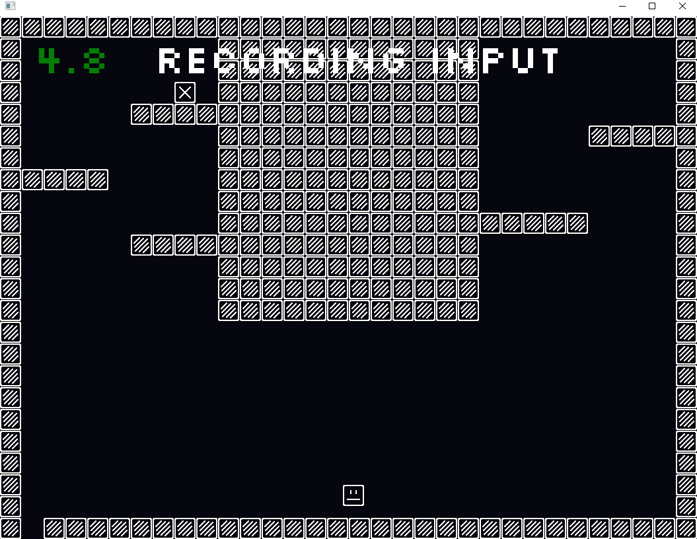
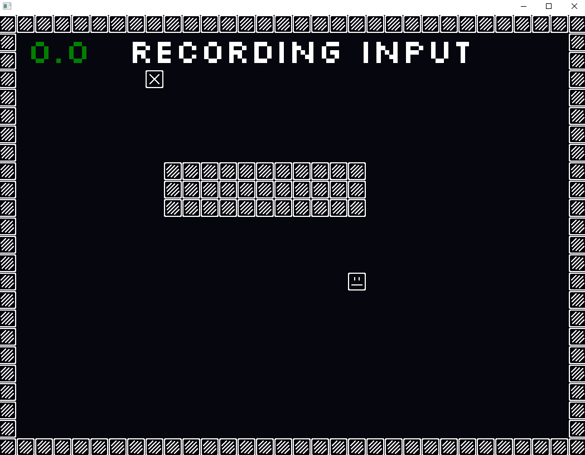
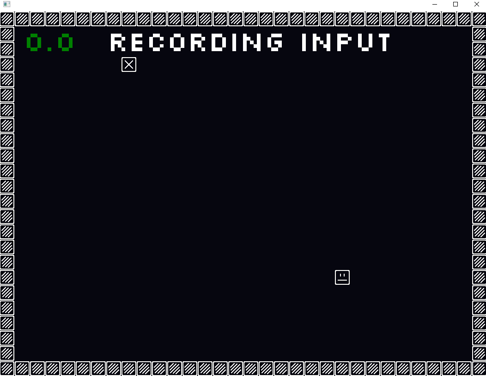

# Project Overview

## Summary
    We created a game which was meant to showcase the  
    command pattern. The goal of the game is to  
    reach the goal in as short of a path as possible.
    We created a very simple level editor which  
    reads from a textfile to create a grid for our game.

## Controls
    You record movement with 'WASD' and press enter  
    to replay what you recorded, try to reach the goal.

## Design Patterns
### Command
- Command.h
> This was the central focus of the project, the game idea itself was spawned
> from this pattern in combination with Event Queue. We chose this pattern 
> for two reason, one it looked useful, powerful and fun. We made it fit the game.

### Event Queue
- EventHandler.h
### Singleton
- TextureManager.h/cpp
- GameManager.h/cpp
### Composite & Factory
- ComponentCreator.h/cpp
- IComponentFactory.h
- xxCreator.h/cpp
- IComponent.h
- Render.h/cpp
- Collision.h/cp
- Tile.h/cpp
- Movement.h/cpp
> During the time we were discussing how we wanted to setup our engine code we landed 
> on using "Entites" as our objects. It was then easy see that having the objects be 
> "dressed" with components would be a clean implementation and to make them handle 
> their own specific gameplay code such as: collision or movement. The code would then
> execute through the Entity sending a call through all of its components without 
> knowing what that component is or what it does. This is the composite pattern we 
> implemented where it solved the logic of gameplay code for us.  
> We also used a factory pattern for how we created the components on the entities
> where you create a unique concrete factory for your component you create. This way
> we could initialize the components in different ways and it also enforces the closed
> for change open for extension because you won't have to go into existing factory code
> if you want to create a new component for example. All the Components have their own
> concrete factory class that implements the Factory interface which in turn creates 
> the concrete component. This way you only work with the interfaces and never know
> about the actual component or factory.
### State
- GameState.h/cpp
- Lose.h/cpp
- PauseState.h/cpp
- PlayState.h/cpp
- Record.h/cpp
- WonState.h/cpp
> To create the bridge between gameplay code and engine code we thought it was 
> appropriate to make a state machine with different states where whole game logic can 
> be in. Since the games core idea was to first record input then play back the input 
> to move the player character it can be handled in two different states. Then we 
> added more states such as the Won and Lost state and also a pause state. These 
> could then all run the logic for the whole game and different conditions could 
> decide if the machine needed to swap to a different state or not.
### Facade 
- Input.h/cpp
### Game Loop
- GameManager.h/cpp
### Subclass Sandbox (maybe)
- Mono.h
- Entity.h/cpp

### ScreenShots:

### GameplayVideo:

